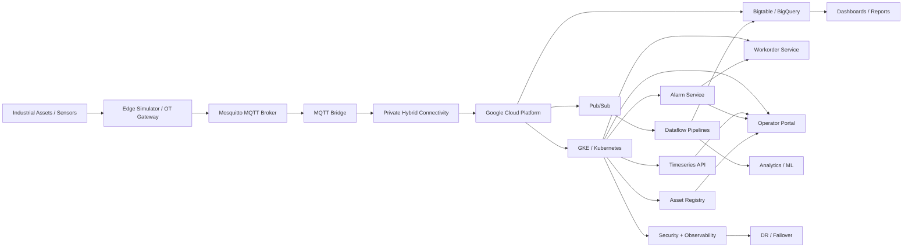

# PetroNova Architecture and Design Overview

## 1. Executive Summary

PetroNova is a reference implementation for an industrial operational technology (OT) and information technology (IT) hybrid platform hosted on Google Cloud. The solution is designed for energy and oil-and-gas environments that need secure telemetry ingestion, operational monitoring, anomaly detection, work order automation, and disaster recovery while maintaining strict isolation between plant systems and cloud services.

This repository represents a complete architecture blueprint rather than a single application. It combines:

- cloud landing-zone setup
- secure networking and hybrid connectivity
- Kubernetes-based runtime platform
- event-driven application services
- streaming data processing
- analytics and reporting
- observability and monitoring
- security controls and compliance evidence
- disaster recovery preparation

The design follows industrial reference patterns such as OT/IT segmentation, Purdue-inspired zoning, private connectivity, and strong governance controls.

---

## 2. Business Objective

The core purpose of the platform is to capture operational telemetry from industrial assets, process it in a secure cloud environment, detect abnormal conditions, trigger alarms and work orders, and provide operational visibility to engineers and operators.

The platform addresses the following business needs:

- secure integration between field devices and cloud systems
- continuous monitoring of equipment health and process conditions
- detection of anomalies and critical alarms
- workflow automation for maintenance and response
- centralized analytics for operational insight
- auditability for compliance and security review
- resilience and failover readiness for production environments

---

## 3. High-Level Architecture

The architecture follows a layered model:

1. Edge / OT layer
   - field devices or simulated industrial sensors
   - edge gateway and site simulator
   - private connectivity into cloud

2. Secure connectivity layer
   - NCC hub
   - VPN tunnels
   - Interconnect / hybrid routing
   - DMZ and restricted access paths

3. Platform layer
   - GKE cluster
   - managed services such as Pub/Sub, Bigtable, BigQuery, Cloud SQL, Storage
   - Kubernetes-based deployment of application services

4. Data processing layer
   - streaming pipelines
   - transformation and event enrichment
   - data validation and deduplication
   - historical and operational analytics

5. Application layer
   - time-series API
   - alarm service
   - asset registry
   - work order service
   - operator portal

6. Security and governance layer
   - VPC Service Controls
   - identity and access controls
   - security rules and detection logic
   - evidence generation and audit artifacts

7. Resilience layer
   - observability and alerts
   - DR scripts and failover procedures
   - disaster recovery environment configuration

---

## 4. Repository Structure and Design Intent

### 01-landing-zone
This folder establishes the cloud foundation and enterprise platform baseline.

It includes:

- organization setup
- folders and hierarchy
- IAM and access policies
- security guardrails
- network design and connectivity services
- NCC hub, VPN, Interconnect, and routing elements
- DNS and project organization

This is the foundation on which the platform and workloads are later built.

### 02-platform-infra
This folder creates the runtime cloud platform.

Key services include:

- GKE for Kubernetes workloads
- Pub/Sub for messaging
- Bigtable for high-scale time-series or operational data
- BigQuery for analytics and reporting
- Cloud SQL for structured services
- Cloud Storage for artifacts and data staging
- site simulation environment and hybrid connectivity

This layer is the operational backbone of the platform.

### 03-platform-charts
This folder contains Helm charts used to deploy platform services consistently.

It includes:

- shared library chart
- tenant-specific chart
- add-ons for platform behavior and integration

This enables repeatable deployment patterns across environments.

### 04-contracts
This folder defines the data contracts used across services.

It contains:

- telemetry schema definitions
- alarm event schema
- BigQuery table structure definitions

This is important because it ensures consistent message validation, interoperability, and downstream processing.

### 05-services
This is the application layer of the solution.

The main services are:

- edge simulator: generates industrial telemetry and simulates field conditions
- mosquitto: MQTT broker for lightweight messaging
- mqtt-bridge: bridges site data into the cloud environment
- timeseries-api: exposes operational trend data
- alarm-service: validates and raises alarms based on threshold or anomaly logic
- asset-registry: stores metadata and context for assets and equipment
- workorder-service: creates and manages maintenance work orders from alarms
- operator-portal: provides user-facing dashboard and operational monitoring UI

These services form the operating model of the platform.

### 06-data-pipelines
This folder contains data processing and analytics components.

It includes:

- Dataflow streaming jobs
- transformation logic
- replay and deduplication logic
- BigQuery SQL transformations
- Vertex AI / BigQuery ML pipeline patterns

This layer converts raw telemetry into trustworthy operational insights.

### 07-deployments
This folder centralizes deployment logic across environments.

It includes:

- dev, prod, and prod-dr configurations
- bootstrap scripts
- environment deployment automation

This supports environment-specific rollout and lifecycle control.

### 08-ci-templates
This directory contains reusable CI/CD templates and automation patterns.

It supports:

- secure pipeline execution
- reduced deployment errors
- consistent release management in cloud-native teams

### 09-observability
This folder supports operational monitoring.

It covers alerts and monitoring for:

- BGP routing health
- VPN and connectivity status
- interconnect status
- backlog and lag conditions
- silent site behavior

This is essential for detecting degradation or isolation events in a hybrid environment.

### 10-security
This folder focuses on governance, compliance, and defensive configuration.

It contains:

- VPC Service Controls
- SecOps detection rules
- IEC 62443 alignment matrix
- evidence generation scripts

This layer is critical for ensuring the platform adheres to industrial security expectations.

### 11-dr
This folder contains disaster recovery mechanics, including failover procedures and testing workflows.

It enables rapid recovery planning for production outages and regional disruption scenarios.

### docs
The documentation bundle includes implementation guidance, deployment runbooks, and operational playbooks for labs and demonstrations.

---

## 5. End-to-End Data Flow

The platform operates in the following order:

1. Field devices or simulated industrial assets generate telemetry.
2. The edge simulator produces event or sensor payloads.
3. Messages are sent through MQTT using a broker such as Mosquitto.
4. The MQTT bridge forwards the data into the cloud environment through a secure, private connectivity path.
5. Event contracts are validated and parsed by the pipeline.
6. Streaming logic cleanses, enriches, and deduplicates the data.
7. Time-series and structured operational data are stored in analytics services.
8. The alarm service reviews conditions and raises actionable alerts.
9. Work orders are created for maintenance or response workflows.
10. Operators view live trends and status through the portal.
11. Monitoring and security systems continuously validate that the environment remains healthy.

This creates a full operational loop from asset data collection to operator response.

---

## 6. Design Principles

The solution is built around several core principles:

### Secure isolation
Industrial systems remain separated from public or unrestricted internet exposure. Connectivity is private and governed through controlled routing and segmentation.

### Zero-trust-oriented network design
The environment assumes no implicit trust between network domains. Internal access is restricted and validated.

### Data quality and contract enforcement
The platform relies on formal data contracts to ensure that telemetry is consistent, valid, and safe to process.

### Hybrid OT/IT integration
The architecture intentionally bridges operational plant data with cloud-native IT and analytics services.

### Operational visibility
Telemetry, alarms, and system states are exposed to operators and engineering teams in real time.

### Resilience and failover readiness
The design includes DR planning and recovery workflows so production operations can be maintained under stress or outage conditions.

---

## 7. Design Architecture

### 7.1 Logical Architecture View

The platform is designed as a layered architecture with clear separation between the operational domain and the cloud-controlled domain.

### 7.2 Component Relationships

The architecture can be understood as a chain of operational responsibilities:

- OT devices generate telemetry at the plant or field edge.
- The edge gateway simulates real industrial production conditions and pushes signals to the broker.
- MQTT acts as the lightweight messaging backbone for operational payloads.
- The bridge converts field traffic into cloud-acceptable streams.
- Secure network connectivity ensures traffic moves through approved private paths rather than public internet exposure.
- Data processing services validate, transform, and store data in analytics repositories.
- Operational services expose trends, alerts, and action items to human users.
- Security, observability, and disaster recovery services monitor the entire system and protect operational continuity.

### 7.3 Layered Design Pattern

The design follows a clean separation of concerns:

- Edge and control layer: devices, simulator, and plant network conditions
- Messaging layer: broker and message routing
- Integration layer: bridge and secure cloud ingress
- Processing layer: transformation and analytics pipelines
- Application services layer: operational APIs and business workflows
- Governance layer: security, policy, evidence, and compliance
- Recovery layer: observability and failover readiness

This layered model makes the platform scalable, testable, and easier to secure.

---

## 9. Security Model

Security is one of the central themes of the project.

The platform emphasizes:

- Purdue-style or IEC 62443-inspired segmentation
- separation of OT and IT networks
- limited inbound access to OT environments
- private-only connectivity using secure networking constructs
- DMZ-style separation for edge or plant simulation components
- least-privilege access patterns
- centralized security monitoring and evidence generation

This security strategy is not peripheral; it is part of the foundation of the platform design.

---

## 10. Resilience, Monitoring, and DR

### Observability
Monitoring is designed to detect issues such as:

- BGP instability
- VPN issues
- interconnect failure
- site connectivity loss
- telemetry backlog
- delayed processing
- silent-site conditions

### Disaster recovery
The project includes infrastructure and scripts to support failover and test-based recovery. This is essential for continuity when a primary site or region becomes unavailable.

The goal is to ensure that operations can continue through a controlled failover process rather than through ad hoc recovery.

---

## 11. Practical Example of the System in Action

A simple real-world scenario is as follows:

1. A compressor sensor reports abnormal vibration and temperature.
2. The edge simulator emits telemetry into the MQTT pipeline.
3. The cloud pipeline validates and ingests the event.
4. The time-series API updates trend data.
5. The alarm service identifies the abnormal condition.
6. A critical alarm is raised.
7. The workorder service creates a draft maintenance task.
8. The operator portal shows the alert and tracking status.
9. Security monitoring and platform observability validate that the system is healthy.
10. If the site loses connectivity, the system buffers and replays data and remains operational according to DR and monitoring policies.

This is the core operational cycle of the platform.

---

## 12. Key Takeaway

PetroNova is not a simple app or demo site. It is a reference architecture for a secure industrial monitoring and control platform on GCP. It brings together cloud-native engineering, hybrid networking, operational telemetry, analytics, automation, security, and resilience into a single architecture blueprint.

In one sentence:

This project demonstrates how industrial sensor data can be securely collected, processed, analyzed, and acted upon in a cloud environment while preserving operational safety, segmentation, governance, and continuity.

